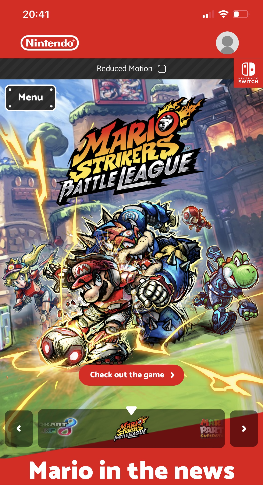
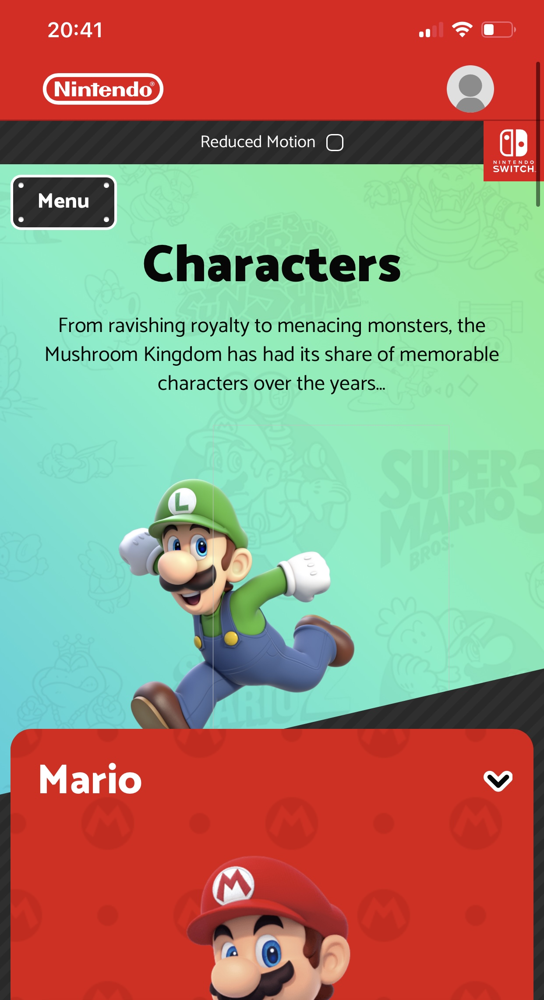
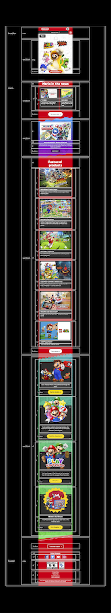
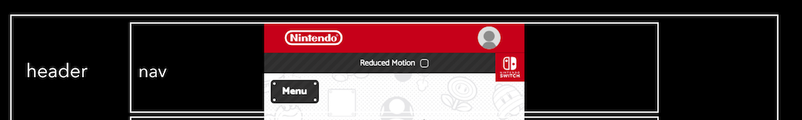
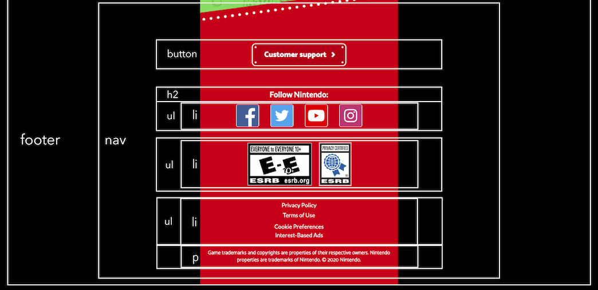

# Procesverslag
Markdown is een simpele manier om HTML te schrijven.  
Markdown cheat cheet: [Hulp bij het schrijven van Markdown](https://github.com/adam-p/markdown-here/wiki/Markdown-Cheatsheet).

Nb. De standaardstructuur en de spartaanse opmaak van de README.md zijn helemaal prima. Het gaat om de inhoud van je procesverslag. Besteedt de tijd voor pracht en praal aan je website.

Nb. Door *open* toe te voegen aan een *details* element kun je deze standaard open zetten. Fijn om dat steeds voor de relevante stuk(ken) te doen.

## Jij

  
uitwerken voor kick-off werkgroep

  ### Auteur:
  Aleid Vliegers

  #### Je startniveau:
  Rood

  #### Je focus:
  Surface Plane
 

## Je website

  
uitwerken voor kick-off werkgroep

  ### Je opdracht:
  https://mario.nintendo.com

  #### Screenshot(s) van de eerste pagina (small screen): 
  hier de naam van de pagina  
  

  #### Screenshot(s) van de tweede pagina (small screen):
  hier de naam van de pagina  
  
 

## Toegankelijkheidstest 1/2 (week 1)

  
uitwerken na test in 1e werkgroep

  ### Bevindingen
  Lijst met je bevindingen die in de test naar voren kwamen:

  #### Screenreader
  Hier korte omschrijving (met indien nodig afbeeldingen)
  
  > Tijdens het onderzoek m.b.t. de screenreader kwam ik er achter dat de screenreader al snel voor chaos en
  paniek zorgt. M.b.t. mijn website kwam ik achter de volgende bevindingen:
  > Op Safari werkt de combinatie van tab en voice over met mijn website niet. Op Google Chrome wel.
  > De links zijn er lang.
  > De links laten ook data's zien die niet relevant zijn.
  > De screenreader benoemd de inhoud via de tab of via de muis goed.

  Hier een omschrijving van hoe het opgelost kan worden (met indien nodig afbeeldingen)
  > De links relevanter en korter maken.

  #### Muis en Toetsenbord 
  Hier korte omschrijving (met indien nodig afbeeldingen)
  
  >Tijdens het onderzoek m.b.t. muis en toetsenbord kwam ik achter de volgende bevindingen:
  > De focus state met tab werkt heel erg goed. De website maakt gebruik van een zwarte en gele border waardoor er een goed contrast ontstaat.
  > Het navigeren via de tab op mijn website werkt goed. Het gaat van links naar rechts, van boven naar onder, en slaat niets belangrijks over.

  Hier een omschrijving van hoe het opgelost kan worden (met indien nodig afbeeldingen)
  ...

  #### Motoriek (shocks, elastiekjes)
  Hier korte omschrijving (met indien nodig afbeeldingen)
  
  > Tijdens het onderzoek m.b.t. motoriek kwam ik achter de volgende bevindingen:
  > Met twee vingers die niet goed werken (elastiekjes) kwam ik er achter dat je een telefoon alsnog gemakkelijk kan bedienen.
  > Een toetsenbord en vooral een trackpad bedienen werkt net wat vervelender.
  > Toch kun je bij de meeste apparaten er wel omheen werken.
  > Wanneer je arm shocked (shock apparaat) kan het erg lastig zijn om met een toetsenbord te werken.
  > Priegel elementjes zijn dan lastig om mee te werken.

  Hier een omschrijving van hoe het opgelost kan worden (met indien nodig afbeeldingen)
  > Er zou gekeken kunnen worden naar een breder assortiment aan gestures voor trackpad om het navigeren gemakkelijker te maken.
  > Knoppen kunnen groter gemaakt worden zodat als je arm of vinger alle kanten op gaat het makkelijker wordt om er op te klikken.
  

  #### Visueel (brillen, contrast, kleurenblind, dark/light). 
  Hier korte omschrijving (met indien nodig afbeeldingen)
  
  Tijdens het onderzoek m.b.t. visual kwam ik achter de volgende bevindingen:
  > Met de vlekkerige bril: door de velle kleuren combinatie van mijn website kon ik de inhoud nog goed zien.
  > Met de kleurenblind bril: er worden veel kleuren op de website getoond, met de bril op worden de kleuren minder maar er is nog steeds veel onderscheid te zien.

  Hier een omschrijving van hoe het opgelost kan worden (met indien nodig afbeeldingen)
  ...
  
  

## Breakdownschets (week 1)

  
uitwerken na afloop 2e werkgroep

  ### de hele pagina: 
  

  ### dynamisch deel (bijv menu): 
  

  ### wellicht nog een dynamisch deel (bijv filter): 
  

## Voortgang 1 (week 2)

  
uitwerken voor 1e voortgang

  ### Stand van zaken
  > Het begrijpen van de code vind ik goed gaan, maar het toepassen gaat lastiger dan gedacht. 

  ### Agenda voor meeting
  samen met je groepje opstellen

  > | Noah           | Isa         | Aleid          | Sam                    |
  > | ---            | ---         | ---            | ---                    |
  > | Grid of Flex   | Z-index     | Position       | Position afb + button  |
  > | Schalen        | Grid        | Button:hover   |                        |
  > | Nav overlay    |             | Button fout    |                        |

  ### Verslag van meeting
  hier na afloop snel de uitkomsten van de meeting vastleggen
  
  > Position veranderen naar Flexbox en margin negatief.
  > Onzichtbare border toegevoegd
  > Foutmeldingen van de <button> opgelost

## Voortgang 2 (week 3)

  
uitwerken voor 2e voortgang

  ### Stand van zaken
  hier dit ging goed & dit was lastig (neem ook screenshots op van delen van je website en code)

  ### Agenda voor meeting
  samen met je groepje opstellen

  > | Oriana         | Minke              | Aleid    
  > | ---            | ---                | ---          
  > | dit bespreken  | en dit             | Een img herhalen als achtergrond   
  > | en dat ook nog | dit als er tijd is | Checkbox  

  ### Verslag van meeting
  hier na afloop snel de uitkomsten van de meeting vastleggen

  > Snel gelukt om een afbeelding op de achtergond te laten herhalen.
  > Checkbox is ook gelukt zonder label nog.

## Toegankelijkheidstest 2/2 (week 4)

  
uitwerken na test in 8e werkgroep

  ### Bevindingen
  Lijst met je bevindingen die in de test naar voren kwamen (geef ook aan wat er verbeterd is):

  #### Screenreader
  Hier korte omschrijving (met indien nodig afbeeldingen)

  Hier een omschrijving van hoe het opgelost kan worden (met indien nodig afbeeldingen)

  #### Muis en Toetsenbord 
  Hier korte omschrijving (met indien nodig afbeeldingen)

  Hier een omschrijving van hoe het opgelost kan worden (met indien nodig afbeeldingen)

  #### Motoriek (shocks, elastiekjes)
  Hier korte omschrijving (met indien nodig afbeeldingen)

  Hier een omschrijving van hoe het opgelost kan worden (met indien nodig afbeeldingen)

  #### Visueel (brillen, contrast, kleurenblind, dark/light). 
  Hier korte omschrijving (met indien nodig afbeeldingen)

  Hier een omschrijving van hoe het opgelost kan worden (met indien nodig afbeeldingen)

## Voortgang 3 (week 4)

  
uitwerken voor 3e voortgang

  ### Stand van zaken
  hier dit ging goed & dit was lastig (neem ook screenshots op van delen van je website en code)

  ### Agenda voor meeting
  samen met je groepje opstellen

  | student 1      | student 2          | student 3    | student 4        |
  | ---            | ---                | ---          | ---              |
  | dit bespreken  | en dit             | en ik dit    | en dan ik dat    |
  | en dat ook nog | dit als er tijd is | nog een punt | dit wil ik zeker |
  | ...            | ...                | ...          | ...              |

  ### Verslag van meeting
  hier na afloop snel de uitkomsten van de meeting vastleggen

  - punt 1
  - punt 2
  - nog een punt
  - ...

## Eindgesprek (week 5)

  
uitwerken voor eindgesprek

  ### Je uitkomst - karakteristiek screenshots:
  

  ### Dit ging goed/Heb ik geleerd: 
  Korte omschrijving met plaatjes

  

  ### Dit was lastig/Is niet gelukt:
  Korte omschrijving met plaatjes

  

## Bronnenlijst

  
continu bijhouden terwijl je werkt

  Nb. Wees specifiek ('css-tricks' als bron is bijv. niet specifiek genoeg).

  > https://fonts.google.com/
  > https://www.w3schools.com/tags/att_input_type_checkbox.asp

